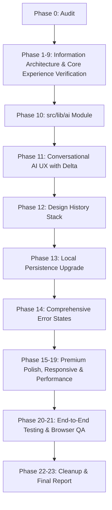

# Complete Product Audit: KOHLER AI Bathroom Designer

**Audit Date**: September 17, 2026  
**Status**: Phase 0 Complete

---

## Executive Summary

The **KOHLER AI Bathroom Designer** has established an exceptionally solid, verified, and deterministic foundation:
1. **Factual Catalogue**: 288 authentic products with official Indian pricing, real dimensions, and verified assembly relationships.
2. **Deterministic Placement & Constraints**: Metre-based canonical spatial coordinate engine enforcing clearance, ADA offsets, door/window clearances, and host relationships.
3. **Asset Pipeline**: 229 normalized GLBs with canonical Z-up coordinates and deterministic asset resolution.
4. **Renderer**: Three.js/React Three Fiber bathroom volume with continuous limestone/basalt materials, fluted feature wall, and procedural fixtures.
5. **Core Experience**: Template selection (5 seed templates + scratch), 2-way bound brief with natural language extraction, 3D reveal with multi-variants (Design A/B/C), dynamic camera presets, and interactive fixture focus.

To complete the product end-to-end to Apple-grade standards, the remaining work centers on:
- Formalizing the `src/lib/ai/` module with clean provider abstraction & deterministic fallback.
- Building the complete conversational AI modification UX with message history, command interpretation, and "what changed" delta cards.
- Adding client-side design history (`Current`, `Previous`, `Restore`).
- Deepening persistence and error/empty/impossible state handling.
- Final visual polish, responsive validation, end-to-end flow testing (Flows A–F), and final reporting.

---

## 1. Routes & App Structure

| Route | Purpose | Status | Audit Finding |
|---|---|---|---|
| `/` | Main consumer-facing editorial design journey | Working & Complete | Needs integration of AI conversation UX, design history restore, and polish. |
| `/designer` | Fullscreen 3D canvas viewport | Working | Useful for direct 3D inspection. Keep intact. |
| `/dev/3d-inspector` | Developer inspection of individual 3D assets | Working | Keep intact behind dev tools. |
| `/api/design-state` | Dynamic variant generation & baseline retrieval | Working | Generates real Design A/B/C variants from brief inputs. |
| `/api/asset-manifest` | Manifest of 229 normalized GLB assets | Working | Fast in-memory resolution. |
| `/api/3d-assets/[code]`| Static file server for normalized GLBs | Working | Serves optimized models with caching. |

---

## 2. Component Inventory & Quality Assessment

| Component | File Path | Current Status | Needed Enhancements |
|---|---|---|---|
| **ExperienceNav** | `src/components/experience/ExperienceNav.tsx` | Working | Add history restore badge or status indicator when previous design exists. |
| **HeroSection** | `src/components/experience/HeroSection.tsx` | Working | Apple-level editorial typography, smooth scroll anchor. |
| **TemplateSelector** | `src/components/experience/TemplateSelector.tsx` | Working | 5 architectural presets + scratch. Polished cards with specs. |
| **DesignBriefSection** | `src/components/experience/DesignBriefSection.tsx` | Working | Connected to `naturalLanguageParser`, ft/m unit toggle, budget presets. |
| **DesigningTransition** | `src/components/experience/DesigningTransition.tsx` | Working | Elegant stage-by-stage CAD validation animation. |
| **RevealSection** | `src/components/experience/RevealSection.tsx` | Working | Variant tabs (Design A/B/C), dynamic camera presets, focused fixture badge. |
| **BathroomCanvas** | `src/components/BathroomCanvas/BathroomCanvas.tsx` | Working | Z-up coordinates, architectural textures, contact shadows, fixture focus. |
| **ProductBreakdownSection**| `src/components/experience/ProductBreakdownSection.tsx` | Working | Real products, list prices, dimensions, click-to-focus in 3D. |
| **DesignSummarySection** | `src/components/experience/DesignSummarySection.tsx` | Working | Room bounds, zoning, aesthetic language, validation status. |
| **ModifyWithAiSection** | `src/components/experience/ModifyWithAiSection.tsx` | Functional Prototype | **Needs expansion into full conversational UX**: chat history, user & assistant messages, command preview, "what changed" delta (previous vs new total, changed fixtures). |
| **DesignFailureView** | `src/components/experience/DesignFailureView.tsx` | Working | Factual diagnostics, actionable suggestions to adjust brief. |

---

## 3. Data & AI Subsystems

### Recommendation & Design Generation
- `src/lib/recommendation/recommend.ts`: Deterministic candidate filtering, compatibility resolution, spatial placement, and multi-criteria scoring.
- `src/lib/design/generateVariants.ts`: Produces Design A (Editor's Choice), Design B (Curated Selection), Design C (Alternative Harmony) and honest failure results.
- **Reuse**: Fully verified. Do not modify core scoring or catalogue data.

### AI Architecture (Phase 10 Target)
- Currently, `src/lib/design/commands.ts` parses a fixed set of regex intents.
- **Target Architecture** in `src/lib/ai/`:
  - `types.ts`: `DesignCommand`, `CommandIntent`, `AIConversationMessage`, `DesignChangeDelta`.
  - `provider.ts`: Pluggable AI provider interface with runtime env credentials (e.g. Gemini / OpenAI / mock provider) without hardcoded secrets.
  - `parser.ts`: Robust deterministic parser as primary/fallback when no API key is provided.
  - `applyCommand.ts`: Translates a structured `DesignCommand` into modifications to `UserDesignInput`, runs recommendation, and calculates `DesignChangeDelta`.
  - `index.ts`: Clean public exports.

---

## 4. What Already Works vs. What Remains

### What Already Works
- 100% authentic KOHLER catalogue (288 products, 229 GLBs).
- Metre-based spatial coordinates & placement engine.
- 5 architectural templates + scratch canvas.
- Dynamic multi-variant generation (Design A / B / C).
- Dynamic camera presets that adapt to placed fixtures.
- Interactive fixture selection focusing the 3D scene.
- Budget calculations directly derived from selected products.
- Honest failure states without silent fallbacks.

### What Is Incomplete (Remaining Deliverables)
1. **Dedicated `src/lib/ai/` Module**: Formalize provider interface, command schema, and deterministic execution pipeline.
2. **Conversational AI Experience**: Chat message thread, assistant interpretation, command preview, and "what changed" comparison card.
3. **Design History Stack**: In-memory / client-side stack with `Current Design`, `Previous Design`, and `Restore` actions.
4. **Comprehensive Persistence**: LocalStorage persistence for active design, brief, template, and history stack.
5. **Comprehensive Error/Empty States**: Detailed guidance when inputs violate clearance or catalogue coverage.
6. **Visual & 3D Polish**: High-end editorial typography, calm spacing, subtle transitions.
7. **End-to-End Testing (Flows A through F)**: Systematic automated and browser verification of the full product journey.
8. **Final Completion Report**: `docs/final_product_completion_report.md`.

---

## 5. Dependencies Between Remaining Tasks

